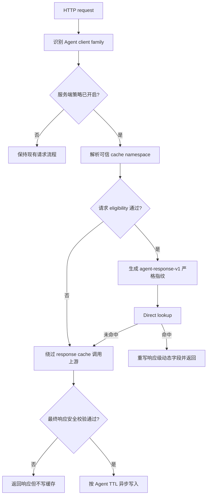

# Agent 客户端安全响应缓存改造方案

| 项目 | 内容 |
| --- | --- |
| 状态 | Draft |
| 目标分支 | `feat/codex-response-cache-opt-in` |
| 适用组件 | HTTP Transport、`semantic_cache` 插件 |
| 首批客户端 | Codex、Claude Code、OpenCode |
| 策略版本 | `agent-response-v1` |

## 1. 背景

Codex、Claude Code、OpenCode 等 Agent 客户端通常使用 Responses API 或 Chat Completions API，并携带工具声明、推理参数及完整上下文。现有 Bifrost response cache 可以直接重放完整响应，但 Agent 请求中可能包含工具执行、外部状态、会话续接或大小写敏感的代码内容，不能按普通问答请求处理。

本方案区分两类缓存：

- **上游 prompt/prefix cache**：由模型供应商复用输入前缀计算，不在 Bifrost 重放完整响应。Agent 请求继续正常使用该能力。
- **Bifrost response cache**：由 Bifrost 直接返回历史完整响应。只对满足严格安全条件的请求开放。

首期改造的核心目标是：客户端不增加 header、不修改请求格式，由服务端显式开启 Agent 缓存策略，并在查询前和写入前分别执行安全校验。

## 2. 目标

1. Codex、Claude Code、OpenCode 客户端无需任何修改。
2. 服务端通过已审计的 `User-Agent` 规则识别客户端，并通过配置显式开启。
3. Agent 请求只使用严格 direct match，不进入 semantic similarity search。
4. 工具声明可以参与缓存指纹，不因 `tools` 非空而一律绕过。
5. 工具调用、工具结果、会话状态和副作用请求不得查询或写入 response cache。
6. 缓存必须按可信服务端身份隔离，不能使用统一共享 cache key。
7. 不改变非 Agent 请求的现有缓存行为，也不影响上游 prompt/prefix cache。

## 3. 非目标

- 不为 Agent 请求启用语义相似匹配。
- 不使用 `User-Agent` 进行鉴权或租户隔离。
- 不缓存工具调用、工具输出、MCP 执行结果或外部检索结果。
- 不支持 `previous_response_id`、conversation ID 等有状态续接请求。
- 不依赖客户端发送 `x-bf-cache-opt-in`。
- 不在第一阶段缓存多模态、拒答、推理状态或不完整流。

## 4. 核心原则

### 4.1 服务端显式 opt-in

“显式 opt-in”由 Bifrost 管理员配置完成，而不是要求客户端改造。默认模式为 `off`，只有配置中列出的客户端家族进入 Agent 缓存判定。

客户端伪造 `User-Agent` 只能进入一套更严格的缓存规则，不能获得身份或权限。真正的缓存隔离仍由服务端可信身份决定。

### 4.2 查询和写入双重门禁

不安全请求必须同时跳过：

- cache lookup；
- semantic lookup；
- cache write。

只设置 no-store 但仍允许 lookup 会返回历史响应，因此不符合本方案。

### 4.3 direct-only

Agent 请求只允许精确指纹命中。即使全局 semantic cache 已启用，也不能对 Agent 请求执行 embedding 或相似度搜索。

### 4.4 fail closed

身份缺失、客户端无法识别、请求字段无法解析、出现未知扩展参数或响应无法完整验证时，一律绕过缓存并正常调用上游。

## 5. 总体流程



请求 eligibility 必须在最终上游请求结构稳定后计算。若 MCP 或其他插件会注入工具，指纹和门禁必须看到注入后的最终请求；不能在请求仍可能被修改时提前计算。

## 6. 配置设计

在 `semantic_cache` 插件配置中增加独立的 Agent 策略：

```json
{
  "name": "semantic_cache",
  "enabled": true,
  "config": {
    "dimension": 1,
    "ttl": "5m",
    "agent_response_cache": {
      "mode": "observe",
      "clients": ["codex", "claude-code", "opencode"],
      "ttl": "60s"
    }
  }
}
```

字段说明：

| 字段 | 默认值 | 说明 |
| --- | --- | --- |
| `mode` | `off` | `off`、`observe`、`cache`。`observe` 只记录判定结果，不查询和写入 |
| `clients` | `[]` | 允许进入策略的客户端家族 |
| `ttl` | `60s` | Agent 安全响应的独立 TTL |

安全门禁在首期为固定策略，不提供逐项关闭开关，避免通过配置意外允许工具结果或会话状态进入缓存。

内部策略版本固定为 `agent-response-v1`，不由管理员修改。任何会改变指纹或 eligibility 语义的代码变更都必须升级策略版本，使旧条目自然失效。

## 7. 客户端识别

HTTP Transport 从 `User-Agent` 识别稳定的客户端家族：

| 客户端 | 家族值 | 匹配示例 |
| --- | --- | --- |
| Codex | `codex` | `codex-tui/...` |
| Claude Code | `claude-code` | 已审计的 Claude Code UA 前缀 |
| OpenCode | `opencode` | 已审计的 OpenCode UA 前缀 |

要求：

- 匹配规则集中维护并有表驱动测试。
- 只把家族值传给插件，不把完整 UA 或客户端版本作为身份。
- 未知 UA、浏览器或普通 SDK 不自动进入 Agent 策略。
- 客户端版本默认不进入指纹；请求结构、工具定义和参数已经负责隔离行为变化。

## 8. 可信缓存命名空间

缓存命名空间必须来自服务端已经验证的身份，优先级如下：

1. Governance virtual key、用户或团队作用域。
2. Direct Key 模式下，由服务端使用 HMAC-SHA256 派生：`direct-key-hmac-v1:<digest>`。
3. 无可信身份时绕过缓存。

禁止行为：

- 使用统一 `default_cache_key` 承载不同 Agent 用户。
- 信任客户端传入的 `x-bf-cache-key` 覆盖服务端命名空间。
- 将原始 Bearer token、API key 或其可逆形式写入 Redis、日志和调试字段。

`User-Agent` 仅决定是否应用 Agent 策略，绝不参与身份隔离。

## 9. 请求 eligibility

### 9.1 允许的请求

首期只接受规范化后的 Chat/Responses 文本请求，并同时满足：

- 输入消息角色仅包含 `system`、`developer`、`user`。
- 所有输入内容均为普通文本。
- Responses 请求显式使用无状态模式，例如 `store=false`。
- 不包含历史 assistant 输出、tool result 或 provider continuation item。
- 所有影响生成结果的参数都能被解析并进入严格指纹。
- 工具声明仅属于经过审计、由客户端执行的声明类型。
- `x-bf-cache-no-store` 未设置为 true。

### 9.2 工具声明

`tools` 非空不再自动判定为不可缓存。完整工具定义进入指纹，包括：

- tool type；
- namespace 和 name；
- description；
- strict 标记；
- 完整 JSON Schema；
- 其他影响调用协议的定义字段。

工具集合使用稳定 canonical JSON 表示。排序键至少包含 type、namespace、name 和完整 canonical definition，最终对完整内容计算摘要。工具顺序变化但集合完全相同时可以复用；任何 schema、description 或 strict 变化都必须 miss。

`tools_hash` 只是请求指纹的一部分，不是独立可复用的缓存对象，也不能证明响应没有副作用。

以下工具在首期直接绕过：

- Bifrost 自动注入或自动执行的 MCP 工具；
- provider 侧执行的 web search、file search、computer use、code interpreter、image generation 等内置工具；
- 无法确定执行边界的未知工具类型。

客户端本地执行的 function/custom 类工具声明可以进入指纹，但最终响应一旦包含 tool call 就禁止写入。

### 9.3 必须绕过的请求

出现任一条件即同时跳过 lookup 和 write：

- `previous_response_id`、conversation ID、thread ID 或其他续接状态；
- `background=true` 或需要 provider 持久化的请求；
- assistant 历史、tool call 历史、tool result/tool output；
- reasoning item、encrypted content、引用对象、文件、图片、音频或其他非文本输入；
- MCP 注入、服务端工具执行或 provider 内置工具；
- 未知 `ExtraParams` 或不能完整 canonicalize 的字段；
- 客户端显式 no-store；
- 缺少可信 cache namespace。

## 10. 严格缓存指纹

现有普通 direct cache 可能对输入做 trim、lowercase 或其他规范化，这对代码、路径、变量名和 JSON 不安全。Agent 路径必须使用独立的严格指纹。

建议 canonical payload：

```json
{
  "policy": "agent-response-v1",
  "namespace": "<server-derived namespace>",
  "client_family": "codex",
  "request_type": "responses_stream",
  "provider": "routerai2",
  "model": "gpt-5.6-sol",
  "stream": true,
  "instructions": "<exact text>",
  "input": "<canonical structured input>",
  "tools_hash": "<sha256>",
  "tool_choice": "<canonical value>",
  "generation_params": "<canonical allow-listed params>"
}
```

对 canonical payload 计算 SHA-256。要求：

- 文本保留原始大小写、空白、换行和 Unicode。
- 数组顺序仅在协议语义允许时才可排序。
- JSON object key 使用稳定排序。
- provider、model、request type 和 stream mode必须进入指纹。
- `tool_choice` 和所有已知生成参数必须进入指纹。
- 未知参数不允许被静默忽略，直接 bypass。
- 只保存 HMAC 后的身份 namespace，不保存原始凭据。

以下请求必须产生不同 key：

```text
print("A")
print("a")
```

以下工具定义也必须产生不同 key：

```text
{"type":"string"}
{"type":"integer"}
```

## 11. 查询规则

1. Agent 请求只查询带有 `policy=agent-response-v1` 标记的条目。
2. 只执行 direct lookup，不执行 embedding 和 semantic search。
3. 历史普通 cache 条目不能命中 Agent 请求。
4. namespace、策略版本、provider、model 或严格指纹任一不同均为 miss。
5. no-store、eligibility 失败和身份缺失必须在 lookup 前结束缓存路径。

## 12. 响应写入门禁

请求通过 eligibility 只代表可以查询，不代表上游响应一定可以写入。上游完成后还必须满足：

- HTTP 和 provider 状态均成功；
- Responses API 状态为 completed，流以合法终止事件结束；
- 输出只包含普通 assistant 文本；
- 不包含 tool call、function call、MCP call 或 tool result；
- 不包含 reasoning state、encrypted item、refusal、annotation、citation 或 provider continuation state；
- 不包含图片、音频、文件、搜索结果或其他多模态内容；
- 不存在 error、incomplete、truncated 或客户端中断。

不安全响应仍原样返回客户端，但不能写入缓存。

### 12.1 流式响应

流式请求必须等完整流结束后再决定是否写入：

1. accumulator 记录是否出现过 tool call、reasoning、非文本事件或错误。
2. 任一不安全事件将该流标记为不可缓存。
3. 只有收到唯一合法的 completed 终止事件后才能异步写入。
4. 连接中断、超时、重复终止事件或无法解析的 SSE event 均丢弃候选条目。
5. 可增长的 chunk buffer 保存在独立 manager 中，context 只保存小型 ID 或布尔标记。

## 13. 命中后的响应处理

缓存内容不能直接携带上一请求的链路标识返回。命中时需要在所有普通响应和 SSE event 中一致处理：

- 生成新的 Bifrost request/trace correlation。
- 生成协议兼容的新 response ID，并统一重写同一流内的引用。
- 更新时间字段。
- 不返回原上游 request ID、trace ID 或连接级 header。
- 对客户端保留兼容的 token usage；内部计费和日志明确标记为 cache hit，不产生本次上游成本。

由于本策略禁止会话续接，缓存生成的 response ID 不得用于 `previous_response_id`。一旦后续请求出现任何 continuation 字段，该请求必须绕过缓存；部署前需要用三类目标客户端验证它们在无状态模式下不会依赖该 ID。

## 14. 可观测性

增加固定枚举的判定原因，禁止把 prompt、工具 schema 或凭据放入 label：

```text
disabled
client_not_allowed
identity_missing
request_type_not_allowed
stateful_input
tool_result_input
server_side_tool
non_text_input
unknown_parameter
no_store
unsafe_response
incomplete_stream
eligible
```

建议指标：

- `bifrost_agent_cache_eligibility_total{client,result,reason}`
- `bifrost_agent_cache_lookup_total{client,result}`
- `bifrost_agent_cache_write_total{client,result,reason}`
- `bifrost_agent_cache_hit_latency_seconds{client}`

日志仅记录 client family、policy version、namespace 摘要、cache result 和 bypass reason。若扩展 wire-visible 的 `cache_debug` schema，需要同步补充 transport/provider harness 测试。

## 15. 与上游 prompt/prefix cache 的关系

Agent response cache miss 或 bypass 时，请求继续完整发送给上游。现有 prompt cache key、retention 或 provider-specific prefix cache 配置保持不变。

两层缓存的关系：

| 场景 | Bifrost response cache | 上游 prompt/prefix cache |
| --- | --- | --- |
| 安全 direct hit | 返回缓存响应，不访问上游 | 不触发 |
| 安全 direct miss | 写入候选，调用上游 | 正常使用 |
| eligibility bypass | 不查询、不写入 | 正常使用 |
| response 不安全 | 不写入 | 本次上游仍可使用 prefix cache |

## 16. 实现范围

这项能力必须改代码，不能只通过页面配置完成。建议改动边界：

| 文件/模块 | 改动 |
| --- | --- |
| `transports/bifrost-http/lib/ctx.go` | 识别客户端家族，写入受控 context |
| `core/schemas/bifrost.go` | 如有必要，增加小型 client family/policy context key |
| `plugins/semanticcache/agentpolicy.go` | 新增请求与响应 eligibility、原因枚举 |
| `plugins/semanticcache/main.go` | 在 lookup/write 两侧接入策略 |
| `plugins/semanticcache/search.go` | 增加严格 direct fingerprint 和策略版本过滤 |
| `plugins/semanticcache/stream.go` | 记录流式安全状态，完成后决定写入 |
| `plugins/semanticcache/utils.go` | 复用或收紧 canonical tools hash |
| `transports/config.schema.json` | 增加 `agent_response_cache` 配置 schema |
| UI Caching 设置 | 后续增加 mode、client allow-list、TTL 控件 |
| `docs/features/semantic-caching.mdx` | 功能落地后补用户文档 |

首个实现 PR 可以先完成 Go 配置、策略和测试，UI 控件拆为后续 PR；未提供 UI 时可通过 `config.json` 或插件 API 管理。

## 17. 测试计划

### 17.1 单元测试

- 三类客户端 UA 正确分类，未知 UA 不分类。
- `mode=off/observe/cache` 行为正确。
- namespace 缺失时 fail closed。
- 文本大小写、空白、换行差异产生不同指纹。
- 工具顺序变化但完整定义相同时指纹一致。
- tool schema、description、strict 或 tool choice 变化时指纹不同。
- tool result、assistant history、continuation、MCP 和 non-text 输入均 bypass。
- 纯文本成功响应可写入；tool call、reasoning、error 和 incomplete 响应不可写入。

### 17.2 Provider harness / 集成测试

- 安全请求第一次 miss，第二次 direct hit，provider 只收到一次请求。
- 不同 Direct Key/virtual key 之间不能互相命中。
- `x-bf-cache-no-store=true` 同时跳过已有 entry lookup 和 write。
- 工具定义变化触发 miss。
- 上游返回 tool call 后，重复请求仍访问 provider。
- tool result 输入始终访问 provider。
- 普通和流式 Responses 均能安全缓存纯文本。
- 流中出现一次 tool call 或 error 即不写入。
- 命中后的 response ID、时间和流内引用一致。
- 非 Agent 请求保持现有 direct/semantic 行为。
- prompt/prefix cache 相关字段在 miss/bypass 时继续透传。

### 17.3 并发与回归

- 使用 `go test -race` 覆盖并发 stream accumulator。
- 多个相同 miss 并发时不产生数据竞争或损坏条目。
- policy version 升级后旧条目不能命中。
- 插件关闭或配置热更新后立即停止 Agent lookup/write。

## 18. 验收矩阵

| 用例 | 预期 |
| --- | --- |
| 同身份、同模型、同文本、同工具，纯文本完成 | 第二次 direct hit |
| `Foo` 与 `foo` | miss |
| 工具定义顺序不同、内容完全相同 | 可 hit |
| 工具 schema 改动 | miss |
| 请求含 tool result | bypass |
| 响应含 tool call | 返回但不写入 |
| 请求含 `previous_response_id` | bypass |
| 不同用户使用相同 prompt | namespace 隔离，miss |
| no-store 请求存在历史 entry | bypass，不读取 |
| Responses 流完整且只有文本 | 可写入并重放 |
| Responses 流中断或包含不安全 event | 不写入 |
| 非 Agent SDK 相同请求 | 保持原缓存逻辑 |

## 19. 发布步骤

### 阶段 0：observe

- 发布代码但 `mode=observe`。
- 仅统计 eligibility 和 bypass reason，不查询、不写入。
- 按客户端观察 3 至 7 天，确认安全请求比例和字段覆盖情况。

### 阶段 1：小流量 cache

- 先只启用 Codex，TTL 60 秒。
- 只启用 strict direct path。
- 观察命中率、错误率、上游请求减少量和 namespace 分布。

### 阶段 2：扩展客户端

- 根据真实 UA 和请求样本逐步启用 Claude Code、OpenCode。
- 新工具类型必须先补 eligibility 和测试，不得默认放行。

### 回滚

将 `mode` 设置为 `off` 即停止 Agent lookup/write。策略版本位于 key 中，无需立即清理旧条目；按 TTL 自然过期即可。

## 20. 已确定的设计结论

1. 客户端不做任何修改，opt-in 由服务端配置完成。
2. `tools_hash` 可以用于隔离工具声明，但不能替代请求和响应安全校验。
3. `tools` 非空不再一刀切；工具执行、工具结果和服务端工具仍必须 bypass。
4. Agent 请求只使用 strict direct cache，不使用 semantic similarity。
5. no-store 必须同时禁止读取和写入。
6. 身份命名空间只接受服务端可信来源，Direct Key 使用 HMAC 派生。
7. 第一阶段只缓存无状态、最终纯文本、完整成功的响应。
8. 先以 observe 模式验证真实流量，再逐步开启。
